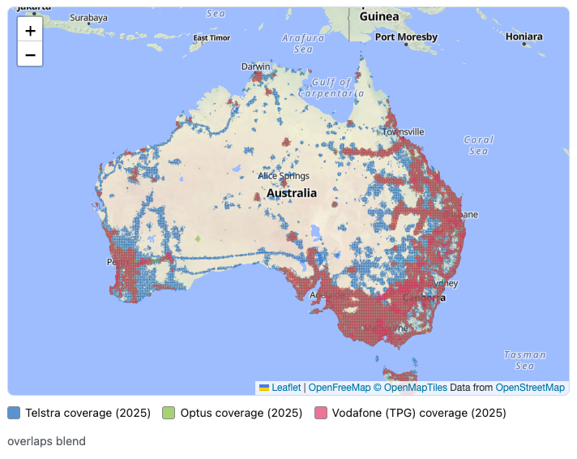

# Australian Mobile Coverage Checker

A simple, **static** web page to compare **Telstra**, **Optus** and **Vodafone (TPG)** mobile coverage at an Aussie address, or between two. 


**🔗 Runs entirely in the browser [Live demo](https://adamxbot.github.io/AUcoverage/)**

[](https://adamxbot.github.io/AUcoverage/)

> Coverage comes from **open Australian Government data** and is
> an *approximate, predictive* estimate. It is **not** the carriers' live maps.

A **data-version toggle** lets you switch between the **2025** ACCC Mobile Infrastructure Report
(default) and the earlier **2021–22** dataset, and each compares all three networks side by side.

## Why now

From **30 June 2026**, the ACMA's *Telecommunications (Mobile Network Coverage Maps) Industry
Standard 2026* requires carriers to publish standardised 4G/5G maps labelled **good / moderate /
basic / no coverage**, and the **ACCC** has warned providers that coverage claims must line up with
those maps. This tool helps consumers compare and sanity-check, then points them at the official,
standard-compliant maps.

## How it works

| Concern | Source | Notes |
| --- | --- | --- |
| "Is this address covered by carrier X?" (2025, default) | [ACCC Mobile Infrastructure Report 2025](https://spatial.infrastructure.gov.au/server/rest/services/Mobile_Coverages_and_Sites_ACCC/MapServer) (ArcGIS `query`, point-in-polygon) | Open, keyless, CORS-open. "Total Outdoor" layers: `20` = Telstra, `14` = Optus, `25` + `31` = TPG (own **+** its coverage on Optus under the **MOCN** deal) |
| "Is this address covered?" (2021–22, baseline) | [Infrastructure RKR by-provider](https://spatial.infrastructure.gov.au/server/rest/services/Communications/Mobile_Phone_Coverage_by_provider/MapServer) | Layers: `0` = TPG, `1` = Optus, `2` = Telstra |
| Map overlay | Same service as the selected version, ArcGIS `export` image per viewport | Rendered under a Leaflet base map |
| Advanced: compare on the map | ArcGIS `export` with a **`dynamicLayers`** renderer override, **one overlay per layer** | Overlay any networks' **Coverage / 5G / 4G** at once. Colour = network; within a network 5G is vivid, 4G lighter. A **colour-blind toggle** gives each network×technology combo its own fill **shape** (Telstra 4G ╱ / 5G ╲, Optus 4G — / 5G ❘, Vodafone 4G ✕ / 5G ＋; total coverage stays solid) so any overlays are distinguishable without colour. 5G/4G are 2025-only; Vodafone includes its MOCN coverage on Optus. (3G retired — not shown.) Each layer is separate, so toggling one is instant and never re-renders the others. |
| Advanced: tower sites | [sites](https://spatial.infrastructure.gov.au/server/rest/services/Communications/Mobile_Phone_Sites/MapServer) service (2022), queried by map extent | Tower sites in the current map view (no address needed), loaded once zoomed in and coloured by carrier — the selected network, or all three |
| Address → coordinates | [OpenStreetMap Nominatim](https://nominatim.openstreetmap.org) | ≤1 req/sec, cached, no autocomplete. Prefers a precise address/town **point** over an admin-boundary (LGA) centroid, and warns when only an area centroid is found |
| Base map tiles | [OpenFreeMap](https://openfreemap.org) vector tiles (MapLibre GL, rendered inside Leaflet) | Keyless, no registration, **no usage limits**, commercial use allowed. Data © OpenMapTiles / OpenStreetMap. Falls back to OpenStreetMap raster tiles if WebGL is unavailable |
| Distance / "between" | Haversine + great-circle sampling (pure JS) | Straight line, not road route |

The **carriers' own maps are proprietary** — they can't be legally/technically overlaid on a static
site — which is exactly why the app leans on the open government dataset for comparison and
**deep-links** to each carrier for the authoritative detail.

### Known limitations (stated in the UI too)

- Government data is **predictive, not measured**, and still lags the carriers' live maps (which are
  updated at least quarterly under the 2026 standard).
- The **2021–22** dataset **understates Vodafone (TPG)** (its regional reach grew via the later Optus
  network-sharing deal); the **2025** dataset fixes this by including TPG's MOCN coverage.
- Most **Telstra MVNOs** ride the *smaller* Telstra Wholesale footprint (Boost is the exception) —
  so non-Boost Telstra brands may get **less** than the shaded Telstra area. The open data has no
  separate wholesale layer, so this is flagged with a note + a link to Telstra Wholesale's own map.
- Geocoding prefers a precise address or town/suburb **point** over a shire/LGA-centroid match, and
  **warns** when only an area centroid is found — but for best accuracy enter a **full street address**.
- The on-map colour comparison (Coverage / 5G / 4G per network) shows the **network** footprints;
  per-carrier 5G/4G exist only in the 2025 data. **3G was shut down in 2024**, so it isn't offered.

## Run it locally

It's static, but geocoding wants an HTTP origin (not `file://`), so serve the folder:

```bash
python3 -m http.server 8000
# then open http://localhost:8000
```
or in your tool of choice.


## Deploy to GitHub Pages

1. Create a repo and push these files to `main`.
2. **Settings → Pages → Build and deployment → Source: GitHub Actions** (a workflow is included at
   `.github/workflows/deploy.yml`), **or** choose *Deploy from a branch → main → / (root)*.
3. Your site publishes at `https://<user>.github.io/<repo>/`.

The included `.nojekyll` stops GitHub from touching the asset paths.

## Project structure

```
index.html          # page structure + content (works without JS for the official links)
styles.css          # mobile-first, high-contrast, WCAG 2.2 AA
js/config.js        # endpoints, layer IDs, carrier→brand mappings, tunables
js/geo.js           # Haversine + great-circle sampling (pure maths)
js/services.js      # geocoding + coverage queries (all network I/O)
js/map.js           # Leaflet map + dynamic government overlays
js/app.js           # UI controller: form, toggles, results, accessibility
```

## Accessibility

- The flow is address → map (with the network/technology layer filters) → text results below; the text results are the source of truth and the map is a labelled visual enhancement.
- Network/technology layers are `aria-pressed` toggle buttons; labelled inputs; `aria-live` result announcements.
- Keyboard operable, visible focus, no colour-only meaning, reflows at 320px / 200% zoom,
  `forced-colors` and `prefers-reduced-motion` support.
- A **colour-blind pattern mode** (advanced) gives each network×technology combo its own fill shape
  (Telstra ╱╲, Optus —❘, Vodafone ✕＋) so overlays are distinguishable without relying on colour.

## Data sources

Everything runs client-side, straight from the browser — no backend, no API key. The app queries or
renders data from four external services, and **deep-links out** to each carrier's own checker. Below
is every source, what it provides, and a link to that **root domain's terms of use and privacy policy**.

### Sources the app queries or renders

| Source | What it provides | Terms of use | Privacy policy |
| --- | --- | --- | --- |
| **Australian Government spatial portal** — `spatial.infrastructure.gov.au` (Dept of Infrastructure, Transport, Regional Development, Communications, Sport & the Arts). Data originates from the **ACCC** Infrastructure RKR audit / Mobile Infrastructure Report; licensed **[CC BY 2.5 AU](https://creativecommons.org/licenses/by/2.5/au/)**. | Coverage polygons (point-in-polygon "is it covered?" + map overlays) and mobile tower/site points | [infrastructure.gov.au/copyright](https://www.infrastructure.gov.au/copyright) · [disclaimers](https://www.infrastructure.gov.au/disclaimers) | [infrastructure.gov.au/privacy](https://www.infrastructure.gov.au/privacy) |
| **ACCC** — `accc.gov.au` (originator of the coverage dataset) | The [Mobile Infrastructure Report](https://www.accc.gov.au/by-industry/telecommunications-and-internet/mobile-services-regulation/mobile-infrastructure-report) underlying the data above | [Disclaimer & copyright](https://www.accc.gov.au/about-us/using-our-website/disclaimer-and-copyright) | [Privacy policy](https://www.accc.gov.au/about-us/using-our-website/privacy-policy) |
| **OpenStreetMap / Nominatim** — `nominatim.openstreetmap.org` (OpenStreetMap Foundation) | Geocoding (address → coordinates). Bound by the [Nominatim Usage Policy](https://operations.osmfoundation.org/policies/nominatim/): ≤1 req/sec, cached, no autocomplete | [OSMF Terms of Use](https://osmfoundation.org/wiki/Terms_of_Use) · [data © OSM contributors](https://www.openstreetmap.org/copyright) | [OSMF Privacy Policy](https://osmfoundation.org/wiki/Privacy_Policy) |
| **OpenFreeMap** — `tiles.openfreemap.org` (`openfreemap.org`) | Base map vector tiles (rendered via MapLibre GL inside Leaflet). Keyless, no limits, commercial OK | [Terms / FAQ](https://openfreemap.org/) · [OpenMapTiles licence](https://github.com/openmaptiles/openmaptiles/blob/master/LICENSE.md) | [Privacy — no cookies, no user data](https://openfreemap.org/) |
| **unpkg** — `unpkg.com` (community CDN, served via Cloudflare) | Delivers the **Leaflet** (`1.9.4`, BSD-2) and **MapLibre GL** (`4.7.1`, BSD-3) libraries + the Leaflet↔MapLibre bridge | [unpkg project](https://github.com/unpkg/unpkg) (no formal ToS published) | [Privacy policy](https://unpkg.com/privacy/) |

> **unpkg caveat:** unpkg is a best-effort community CDN with no uptime guarantee or formal terms. The
> version is already pinned; for production, consider **self-hosting** Leaflet or serving it from a CDN
> with a published SLA.

### Browse or download the exact coverage data

- **Dataset (authoritative landing page):** [ACCC Mobile Infrastructure Report – data release](https://data.gov.au/data/dataset/accc-mobile-infrastructure-report-data-release) on **data.gov.au** — the ACCC's *Audit of Telecommunications Infrastructure Assets (Infrastructure RKR)*, sourced from Telstra, Optus and TPG. Licensed [CC BY 2.5 AU](https://creativecommons.org/licenses/by/2.5/au/).
- **Live services the app actually calls** (open any in a browser to inspect the layers):
  - **2025** — [`Mobile_Coverages_and_Sites_ACCC/MapServer`](https://spatial.infrastructure.gov.au/server/rest/services/Mobile_Coverages_and_Sites_ACCC/MapServer). "Total Outdoor" layers used: `20` Telstra, `14` Optus, `25` + `31` TPG (own **+** its coverage on Optus under the MOCN deal). Per-technology Outdoor: 5G `18` / `12` / `23`,`29`; 4G `19` / `13` / `24`,`30`.
  - **2021–22** — [`Communications/Mobile_Phone_Coverage_by_provider/MapServer`](https://spatial.infrastructure.gov.au/server/rest/services/Communications/Mobile_Phone_Coverage_by_provider/MapServer). Layers: `2` Telstra, `1` Optus, `0` TPG.
  - **Tower sites (2022)** — [`Communications/Mobile_Phone_Sites/MapServer`](https://spatial.infrastructure.gov.au/server/rest/services/Communications/Mobile_Phone_Sites/MapServer), filtered by the `MNO` field.

All of these endpoints and layer IDs live in [`js/config.js`](js/config.js) under `gov.versions`, so they're easy to check or update if the services change.

### Carrier checkers the app links out to (not queried)

The tool never scrapes or overlays the carriers' own maps — they're proprietary. It sends you to each
carrier's official checker for the authoritative answer, so **that carrier's own terms and privacy
apply** once you click through:

| Carrier | Coverage checker | Terms of use | Privacy policy |
| --- | --- | --- | --- |
| **Telstra** | [our-coverage](https://www.telstra.com.au/coverage-networks/our-coverage) | [Terms of use](https://www.telstra.com.au/terms-of-use) | [Privacy](https://www.telstra.com.au/privacy) |
| **Telstra Wholesale** (non-Boost MVNO footprint) | [coverage map](https://www.telstrawholesale.com.au/products/mobiles/coverage.html) | [Legal — Privacy & Terms](https://www.telstrawholesale.com.au/legal.html) | [Legal — Privacy & Terms](https://www.telstrawholesale.com.au/legal.html) |
| **Optus** | [living-network/coverage](https://www.optus.com.au/living-network/coverage) | [Legal](https://www.optus.com.au/about/legal) | [Privacy](https://www.optus.com.au/about/legal/privacy) |
| **Vodafone (TPG)** | [coverage-checker](https://www.vodafone.com.au/network/coverage-checker) | [Website terms of use](https://www.vodafone.com.au/about/legal/online) | [Privacy](https://www.vodafone.com.au/about/legal/privacy) |

## Licences & attribution

- **Coverage & tower data** © Commonwealth of Australia — ACCC *Audit of Telecommunications
  Infrastructure Assets (Infrastructure RKR)* / *Mobile Infrastructure Report*, via
  `spatial.infrastructure.gov.au`. Licensed **[CC BY 2.5 AU](https://creativecommons.org/licenses/by/2.5/au/)**.
- **Geocoding & map data** © [OpenStreetMap](https://www.openstreetmap.org/copyright) contributors
  (Nominatim), under the [ODbL](https://opendatacommons.org/licenses/odbl/).
- **Base map** © [OpenFreeMap](https://openfreemap.org) / [OpenMapTiles](https://www.openmaptiles.org/),
  data © OpenStreetMap contributors.
- **Leaflet** — BSD-2-Clause. **MapLibre GL JS** — BSD-3-Clause.

*Telstra, Optus and Vodafone are trademarks of their respective owners, used here nominatively to
identify each network. This is an independent tool, not affiliated with or endorsed by any carrier.*

## Licence

This project's own code is released into the **public domain** under
[The Unlicense](https://unlicense.org/) — do whatever you want with it, no attribution required.
See [`LICENSE`](LICENSE).

The **data** the app displays is not ours to relicense — keep its attributions (ACCC coverage data
under CC BY 2.5 AU, OpenStreetMap/Nominatim, OpenFreeMap/OpenMapTiles, Leaflet, MapLibre GL).
Details in [`LICENSE`](LICENSE).

Contributions welcome — the carrier→brand lists in `js/config.js` and `index.html` drift over time;
PRs to keep them current are appreciated.
